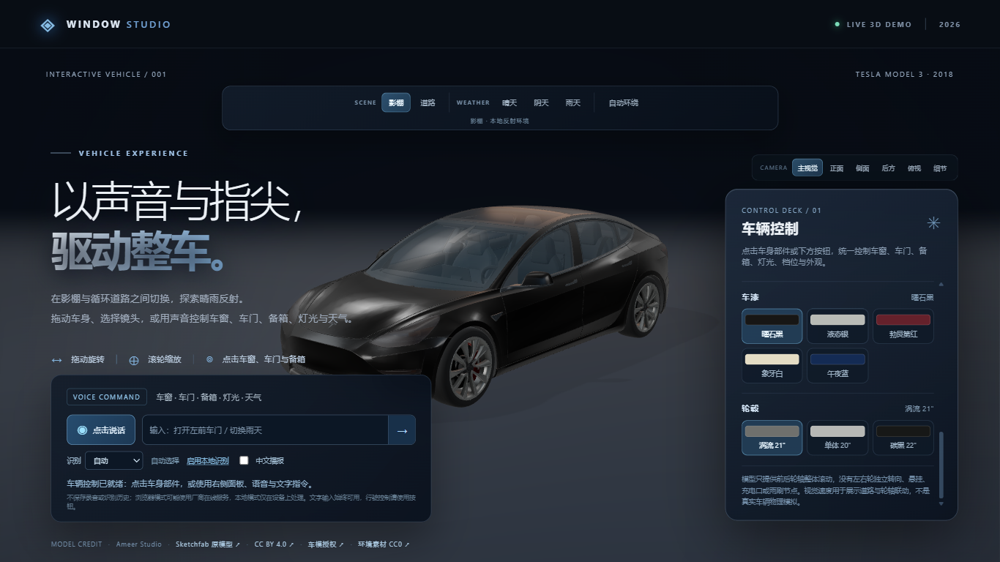

# Tesla Window Studio

一个基于 Vite、原生 JavaScript 和 Three.js 的 Tesla Model 3 交互式 3D 展示 Demo。

项目重点不是静态展示车模，而是把点击、按钮、中文语音和文字输入统一到同一套车辆控制状态机中：用户可以切换影棚/循环道路、四季与五种天气，控制车窗、车门、前后备箱、灯光、档位、速度、车漆和轮毂，并观察这些状态如何联动到 Three.js 场景。

线上演示：[tesla-window-studio-demo.pages.dev](https://tesla-window-studio-demo.pages.dev/)。GitHub 仓库仅用于代码、测试、资产许可和开发记录，当前不使用 GitHub Pages 部署。

## 亮点

### 场景与渲染

- 影棚与循环道路双场景。
- 春、夏、秋、冬四季与晴天、阴天、雨天、雪天、夜晚组成 4 × 5 环境矩阵。
- 六个摄影机预设、平滑镜头过渡和低速自动环绕。
- 道路 HDR、路面纹理和天气粒子按需加载并复用。
- 夜晚启用受控泛光、灯光投射和车身附着光束；低帧率时自动降低粒子和渲染像素比。

### 车辆控制

- 四扇侧窗独立开合，动画中反向操作不会跳变。
- 四门、前备箱、后备箱支持点击和按钮控制，并带行驶互锁。
- 前大灯、雾灯、尾灯支持手动控制；刹车灯和倒车灯随档位/速度自动变化。
- P / D / R 档位、速度上限、换向限制、道路循环和车轮滚动共享同一状态源。
- 五种车漆和三种轮毂预设按网格克隆材质，避免污染共享材质。

### 中文语音与文字控制

支持“自动 / 浏览器 / 本地”三种识别模式：

1. 优先探测浏览器本机中文语言包。
2. 回退到浏览器语音服务。
3. 用户确认后按需加载浏览器端 Whisper tiny q8 Worker。

文字输入始终可用。复合指令支持逗号、“然后”和“再”串联，例如：

    关闭所有车门，然后前进到五十，再打开全部灯光
    换成午夜蓝，选择碳黑轮毂
    关闭雾灯和尾灯
    切到秋天，再切到雪天

解析器会保留执行顺序，普通子句失败不会阻止其余有效操作；涉及安全互锁或歧义时不会猜测执行。

## 快速开始

环境要求：Node.js 24、npm。

    npm ci
    npm run dev

打开终端输出的本地地址即可使用。无需后端服务；模型、HDR、纹理和授权说明都从 public/ 静态路径加载。

### 本地 Whisper（可选）

本地识别需要一个可访问的静态模型前缀。请在本地 .env.local 中设置，不要提交真实配置：

    $env:VITE_ASR_MODEL_BASE_URL = 'https://<你的模型域名>/asr/'
    npm run dev

模型下载清单、文件校验值和 R2 部署注意事项见 [Whisper 模型清单](docs/assets/whisper-tiny-q8-download-manifest.md)。没有该配置时，文字输入和浏览器语音仍可使用。

## 验证

    npm test
    npm run verify:gltf
    npm run verify:model
    npm run build
    npm run verify:deploy
    npm run preview

当前本地验证结果：

- 73 个 Node 测试全部通过。
- GLB 模型检查：301 节点、176 网格、58 材质；控制器必需节点 16/16、材质 14/14。
- 静态部署检查通过，所有产物均低于 Cloudflare Pages 的 25 MiB 单文件限制。

npm run build 会通过 prebuild 自动执行 GLB 和模型节点校验。dist/ 是可再生成目录，不进入版本控制。

## 架构概览

    按钮 / 车身点击 / 中文语音 / 文字输入
                        ↓
                 parseCommand(text)
                        ↓
              CommandDispatcher.execute()
                 ↙                ↘
     VehicleController.dispatch()  EnvironmentController
                 ↓                ↓
           车模节点与材质       Three.js 场景、天气、道路

主要模块：

| 模块 | 职责 |
| --- | --- |
| src/scene.js | 渲染器、灯光、后处理和帧循环 |
| src/environment.js | 影棚/道路、季节、天气、HDR 和道路对象 |
| src/vehicle.js | GLB 加载、部件解析和材质初始化 |
| src/vehicleController.js | 车辆状态机、互锁、灯光、档位、速度和外观 |
| src/parseCommand.js | 中文命令解析、同义词、并列目标和歧义保护 |
| src/commandDispatcher.js | 将标准命令分发到车辆或环境控制器 |
| src/voice.js / src/speech/ | 语音引擎选择、录音、Worker、转写和播报 |
| scripts/verify-model.mjs | 构建前校验模型节点、材质和轮轴位置 |
| scripts/verify-static-deploy.mjs | 校验静态部署文件大小限制 |

## 部署

当前线上站点由 Cloudflare Pages 提供：

- 在线地址：[tesla-window-studio-demo.pages.dev](https://tesla-window-studio-demo.pages.dev/)
- GitHub 不再自动部署 Pages；推送到 main 只同步源代码和开发记录。
- 需要发布新版本时，在本地构建并执行 Cloudflare Pages Direct Upload。

也可以手动使用 Cloudflare Pages Direct Upload：

    $env:VITE_ASR_MODEL_BASE_URL = 'https://<你的模型域名>/asr/'
    npm run build
    npm run verify:deploy
    npx wrangler@4 pages deploy dist --project-name <项目名>

正式部署时请确认 HTTPS、模型静态域名和 R2 CORS；不要把令牌、密钥或 .env.local 提交到 Git。

## 资产与许可证

- Tesla 2018 Model 3 车模来自 Ameer Studio / Sketchfab，遵循 [CC BY 4.0](https://creativecommons.org/licenses/by/4.0/)。署名和完整说明见 [Tesla 车模许可证](public/assets/TESLA-LICENSE.md)。
- HDR、道路纹理等环境素材来自 [Poly Haven](https://polyhaven.com/)，遵循 CC0；来源、文件大小和校验值见 [环境资产清单](public/assets/licenses/ASSET-LICENSES.md)。
- 浏览器端 Whisper tiny q8 使用 Apache-2.0 模型文件，部署清单见 [Whisper 模型清单](docs/assets/whisper-tiny-q8-download-manifest.md)。
- 本仓库没有把 Tesla 车模重新授权为 MIT；网页源码的授权范围以仓库维护者后续声明为准。

## 项目文档

- [开发记录与命令](docs/DEVELOPMENT-LOG.md)：按阶段整理的开发记录、命令和验证结果。
- [项目总览](docs/PROJECT-OVERVIEW.md)：架构、功能和阶段盘点。
- [文档索引](docs/README.md)：文档分类与维护规则。
- [文件清理审计](docs/PROJECT-CLEANUP-AUDIT.md)：本地文件清理、保留项和安全快照记录。
- [设计与实现计划](docs/superpowers/)：设计规格与实现计划。

## 已知边界

模型只提供前后轮轴整体滚动，因此本项目没有虚构左右轮独立转向、悬挂、充电口或雨刷动画。转向灯、双闪和车内灯也不作为可见手动控制项；文字输入始终是语音不可用时的正式降级路径。

## 开发记录

本项目按研究、基线、场景天气、车辆控制、中文语音和渲染收尾逐阶段完成。为减少提交噪声，当前工作区会在验证通过后合并为一次清晰的发布提交；完整提交历史和命令记录见 [开发记录与命令](docs/DEVELOPMENT-LOG.md)。
